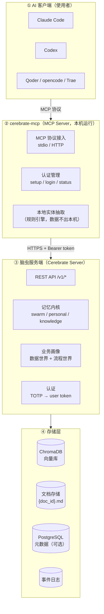
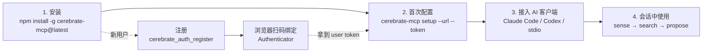

# Cerebrate MCP Server (Node.js)

Cerebrate 脑虫记忆系统的 MCP Server（Node.js 版，零依赖，node >= 16）。

团队长期记忆 + 业务画像 + 本地实体化抽取，供 Claude Code / Codex / Qoder /
opencode / Trae 等 AI 客户端通过 [Model Context Protocol](https://modelcontextprotocol.io)
接入脑虫服务。

## 架构总览

一句话：**你的 AI 客户端通过 `cerebrate-mcp` 连上脑虫服务端，把团队经验读写到共享存储**。
下面两张图分别说明「系统由哪些部分组成」和「从零开始怎么用」。

### 系统架构



各层职责：

| 层 | 组件 | 职责 |
| --- | --- | --- |
| ① 使用者 | Claude Code / Codex / Qoder / opencode / Trae | 你日常对话的 AI 助手 |
| ② 接入层 | cerebrate-mcp | 把 MCP 协议翻译成脑虫 REST API；认证与本地实体抽取 |
| ③ 服务端 | Cerebrate Server | 记忆读写、业务画像、共识进化、鉴权 |
| ④ 存储 | ChromaDB / 文档 / PostgreSQL / 事件日志 | 向量、正文、元数据、审计事件 |

### 接入使用流程



> 新用户：先注册 → 扫码绑定 → 拿到 token 后走第 2 步配置；老用户直接走 1 → 4。

## 安装（npm 标准方式，执行完即完成安装）

```bash
# 全局安装（推荐，一条命令）
npm install -g cerebrate-mcp@latest

# 或免安装直接运行（npx）
npx -y cerebrate-mcp@latest
```

> ⚠️ 请务必带 `@latest`：`npx -y cerebrate-mcp`（漏写 @latest）会命中本地缓存拿到旧版本。

## 首次配置（一条命令完成）

```bash
cerebrate-mcp setup --url https://<脑虫域名>/cerebrate --token <你的user token>
```

执行后自动：
1. 写入 `~/.cerebrate-mcp/cerebrate.env`（chmod 600）
2. 打印各客户端（Claude Code / Codex / stdio）配置片段，复制粘贴即可使用

也支持交互模式：直接运行 `cerebrate-mcp setup` 按提示输入。

## 接入到 AI 客户端

### Claude Code（HTTP 标准接入，推荐，零本地服务）
```bash
claude mcp add --transport http cerebrate https://<脑虫域名>/cerebrate/v1/mcp \
  --header "Authorization: Bearer <你的user token>"
```

### Codex（config.toml）
```toml
[mcp_servers.cerebrate]
url = "https://<脑虫域名>/cerebrate/v1/mcp"
```
token 走环境变量 `CEREBRATE_SERVER_TOKEN`。

### stdio 客户端（Qoder / opencode / Trae）
```bash
# 命令
npx -y cerebrate-mcp@latest

# 环境变量
CEREBRATE_SERVER_URL=https://<脑虫域名>/cerebrate
CEREBRATE_SERVER_TOKEN=<你的user token>
```

## 配置优先级

环境变量 > `~/.cerebrate-mcp/cerebrate.env` > 默认（http://127.0.0.1:8765）。

可用环境变量：
- `CEREBRATE_SERVER_URL` — 脑虫服务地址
- `CEREBRATE_SERVER_TOKEN` — Bearer 鉴权 token（唯一凭证）
- `CEREBRATE_MCP_ENV` — 自定义 env 文件路径（默认 `~/.cerebrate-mcp/cerebrate.env`）
- `CEREBRATE_TOKEN_FILE` — 登录 token 持久化文件（默认 `~/.cerebrate/token`）

## 命令行

```bash
cerebrate-mcp                 # 作为 MCP server（stdio）运行
cerebrate-mcp setup           # 首次配置（交互 / --url --token）
cerebrate-mcp login           # 用户名 + Authenticator 码登录
cerebrate-mcp logout|status   # 登出 / 查看状态
```

## 功能

- 43 个 MCP 工具：记忆检索（sense/search/timeline/detail）、写入（propose/vote/use）、
  业务画像（profile/navigate/harvest）、认证（register/login）、实体抽取（本地）
- 本地实体抽取：规则引擎在本地运行，实体数据不离开本机
- 认证：TOTP（Authenticator）登录，token 为唯一凭证，长期有效

## 安全

- 记忆共享读取，写入须登录（user token）
- 管理工具（注册/rebind/ingest/knowledge_store）仅 master token 可用
- token 文件 chmod 600，仅本机当前用户可读
