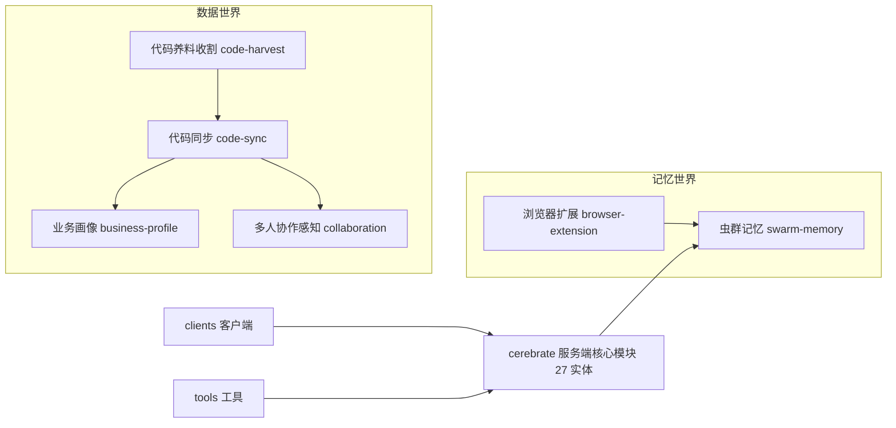
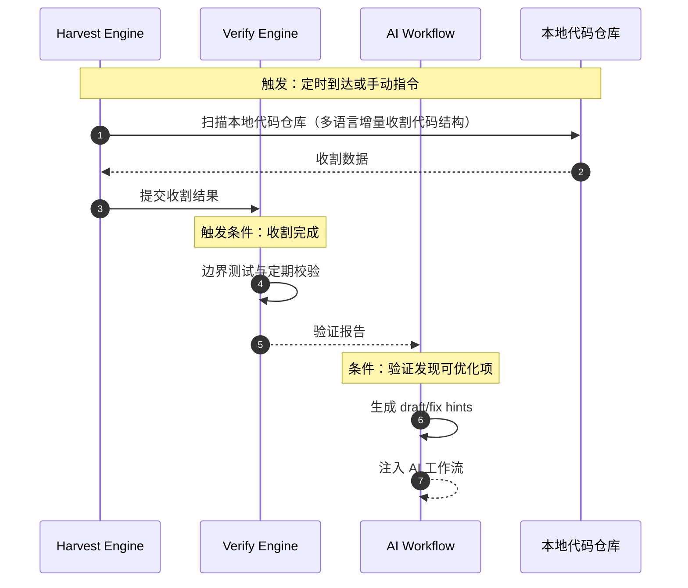
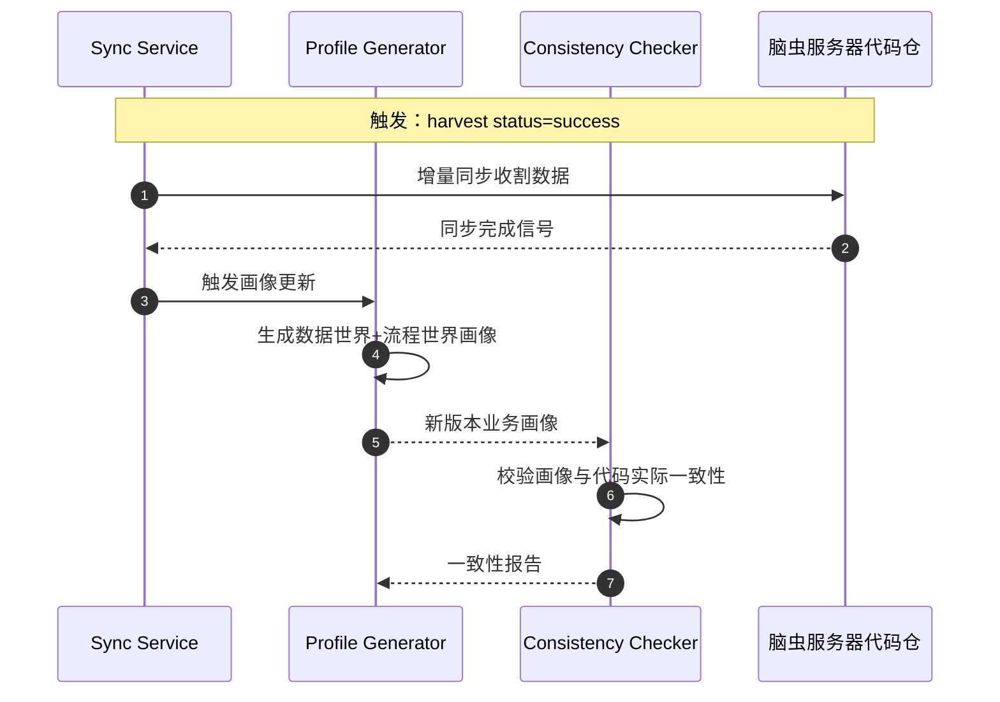
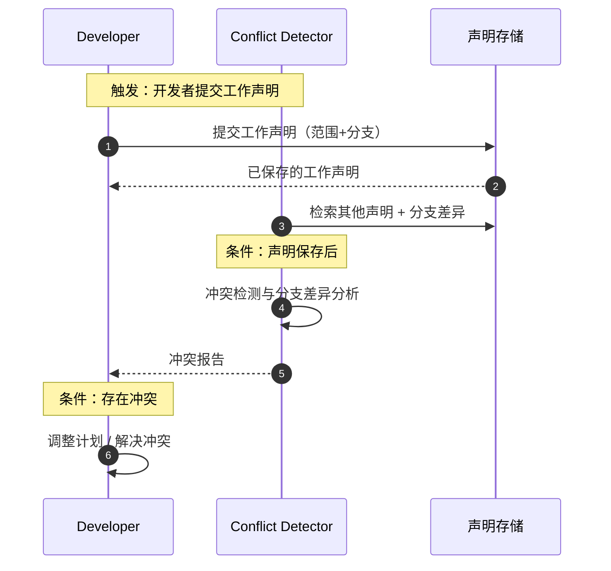
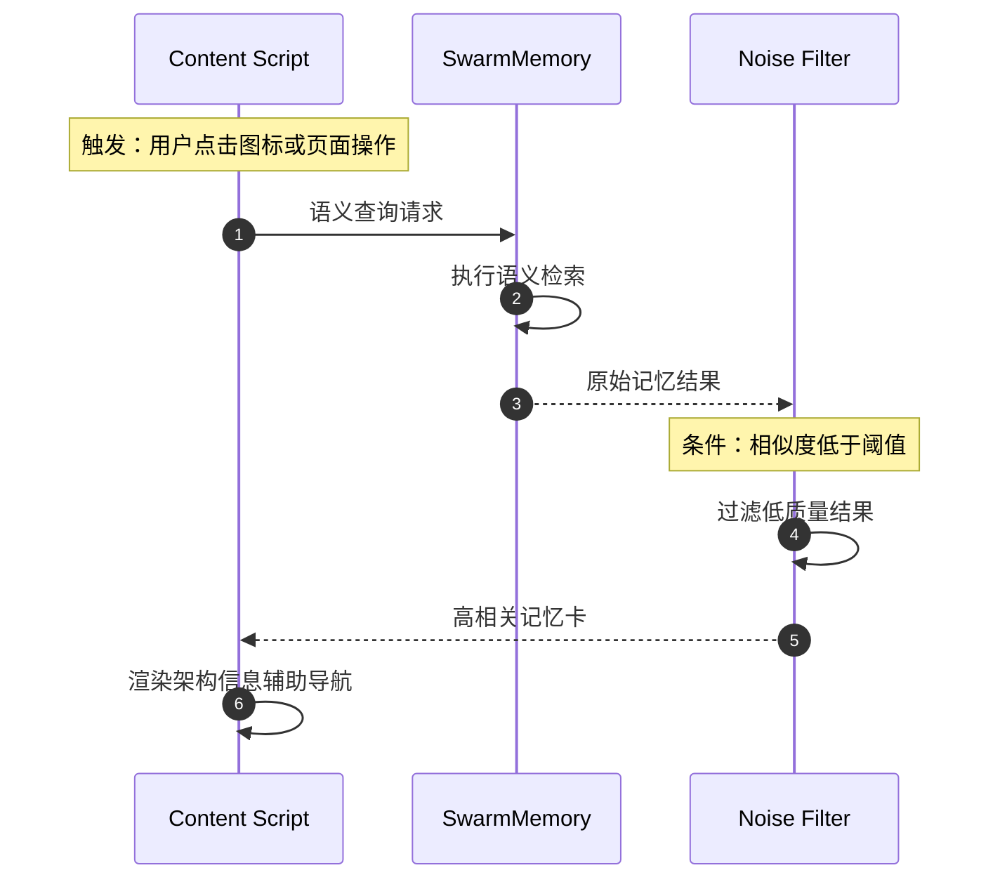
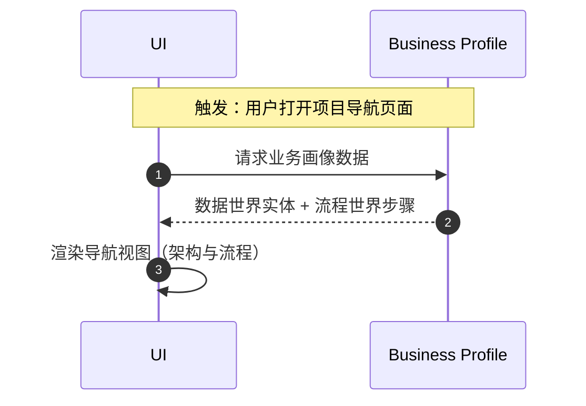
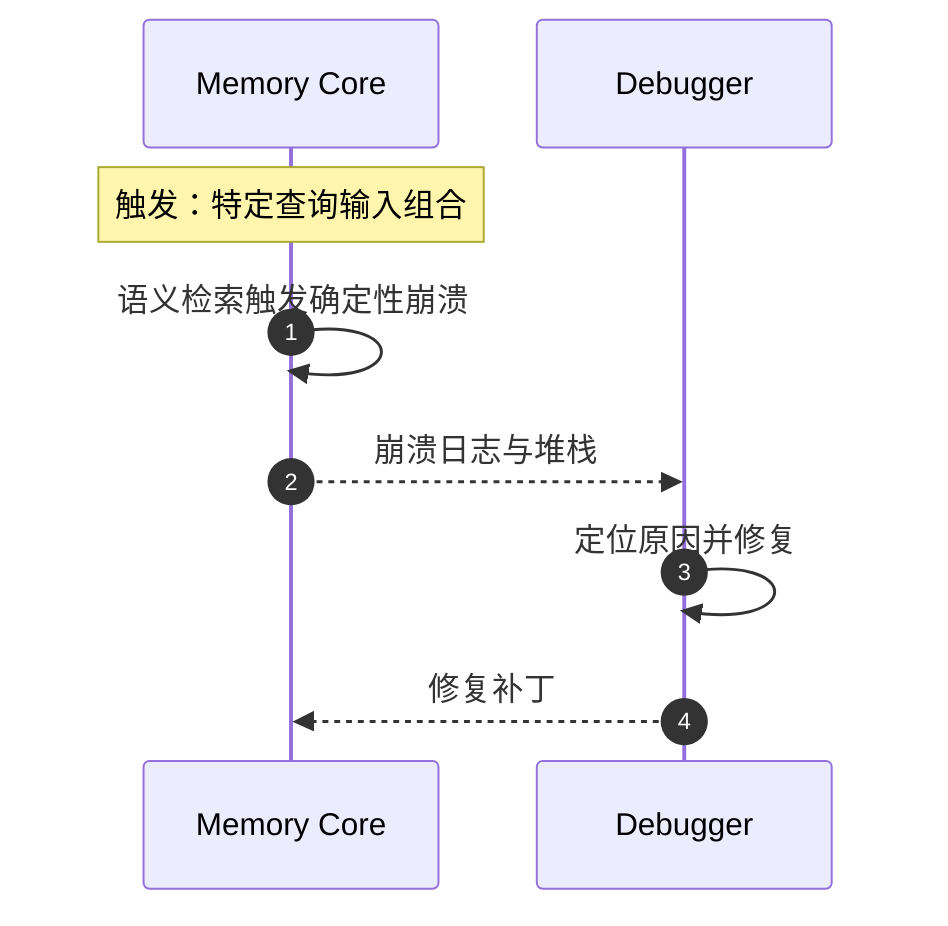

# Cerebrate 功能时序图（Sequence Diagrams）

> 生成日期：2026-08-04
> 数据来源：脑虫业务画像 flows（cerebrate 项目，version 3 confirmed，harvest-push 真实代码结构）
> 渲染：Markdown 支持 mermaid 即可可视化（GitHub / VS Code Markdown Preview 均支持）

## 0. 项目地图（宏观总览）

---

## 1. 代码收割与验证定期化流程

## 2. 代码同步与画像联动流程

## 3. 多人协作冲突感知流程

## 4. 语义记忆检索与噪音规避流程（浏览器扩展）

## 5. 业务画像导航流程

## 6. 记忆核心崩溃处理流程（运维/调试）

