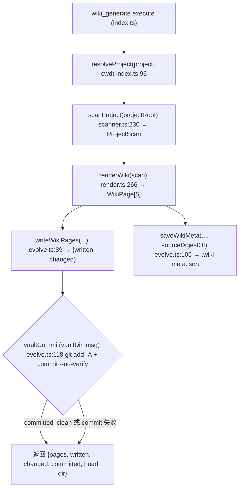
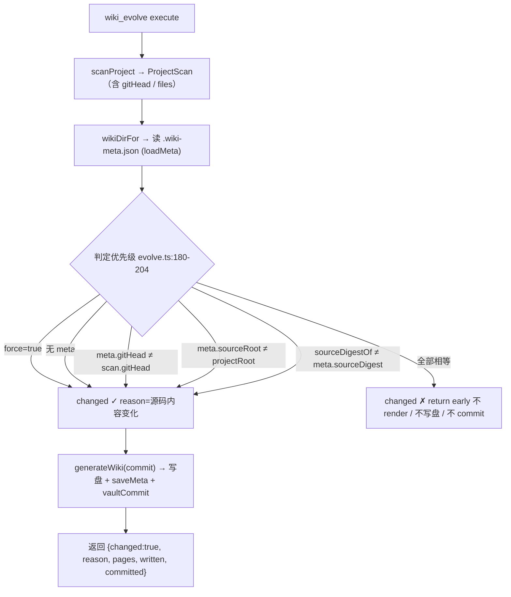
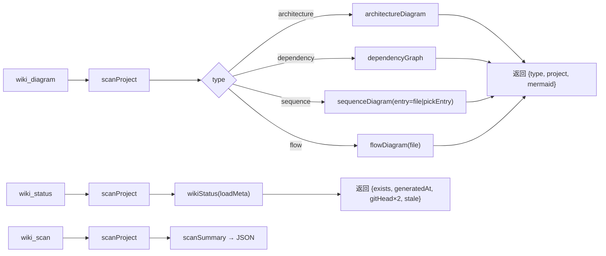

# dsh-project-wiki 技术实现方案（技术经理评审版）

> 本文档以**技术经理视角**设计「技术实现方案」应包含的完整章节，并逐项与现有 5 页
> 知识库（00-README / 01-架构总览 / 02-模块地图 / 03-时序与流程 / 04-API参考）对比，
> 标注当前缺失的章节与**自动生成可行性**（★=可直接从代码自动生成；◐=半自动需要人工确认；○=人工撰写）。
>
> 评审对象：源码 git `f6f32f8` ｜ 知识库生成于 2026-08-24T02:39:00 ｜ 所有结论可溯源到 src/*.ts 与 README。
> 团队记忆 79eda65c81cc20d5（架构 how-it-works）已核对，本方案与之一致并补充了评审视角证据。

---

## 0. 文档位置说明（本文档在知识库体系中的定位）

| 现有页面 | 层级 | 回答的问题 | 本文档对应章节 |
| --- | --- | --- | --- |
| 00-README | 宏观 | 项目是什么、多少代码 | §1 决策背景 |
| 01-架构总览 | 宏观 | 模块怎么连 | §2 模块边界 |
| 02-模块地图 | 中观 | 每个目录里有什么 | §2 |
| 03-时序与流程 | 中观 | 入口调用链、文件内处理顺序 | §3 数据流（补充数据流转而非仅调用链） |
| 04-API参考 | 微观 | 每个符号签名与位置 | §4 接口契约（补充工具级契约，04 只有内部函数） |
| **本文档** | 决策层 | **为什么这么做、怎么保障、怎么部署、坏了怎么查、下一步** | 全部 8 节 |

> 缺失定位：现有 5 页是**结构事实层**（what），本文档补充**决策层**（why）、**保障层**（how to ensure）、
> **运维层**（how to operate），三者恰好是自动生成器目前不产出的部分。

---

## 1. 架构决策记录（ADR）

### ADR-001 代码即文档（Code Is the Language）

- **状态**：已接受（scanner.ts:1-13 模块注释、README「核心理念」）
- **决策**：知识库内容直接由确定性代码扫描（目录树/import/导出/顶层声明）提取，**不**让 LLM 描述项目。
- **为什么**：
  1. **确定性**：同一代码 → 同一知识库。无需 token、无幻觉、可测试（tests/index.spec.ts 逐断言校验扫描结果）。
  2. **1:1 不漂移**：README「进化由 git 检测 + 源码 digest 驱动，代码一变文档立即刷新，1:1 不漂移」。
  3. **零运行时依赖**：scanner.ts 注释「Regex-level parsing … zero runtime dependencies (no parser per language)」，对 25 种语言/扩展统一正则，无 parser 安装与维护成本。
  4. **可溯源**：04-API参考 每条声明带 文件:行号，AI/开发者可直接定位真实实现。
- **代价/边界**：文档是**结构级**而非**语义级**——无法解释业务意图、算法动机、跨文件行为。这类语义必须靠 README/注释（scanner.ts docAbove 最多提取 320 字符）、ADR 这类人工文档补位。
- **对知识库的缺口**：现有 01-04 页只有「代码怎么说」，没有「团队为什么这么定」。◆ **决策理由无法自动生成**（○），因为决策不在代码里；但**决策骨架**（模块有哪些、API 是什么）可自动（★）。

### ADR-002 digest 进化（Deterministic Change Detection）

- **状态**：已接受（evolve.ts:1-14 模块注释；团队记忆坑 1）
- **决策**：进化检测 = `git head` + 全量源码 digest 双信号，快照存 `.wiki-meta.json`；无变化时**不写盘、不提交**。
- **为什么不用 git diff HEAD~1**：
  - 插件项目常不是独立 git 仓库（如 dsh-obsidian 挂在上级仓库 Cerebrate 下），`git diff HEAD~1` 会误判；故退化为「当前 head 字符串 + 扫到的源码内容聚合哈希」。
- **机制**（evolve.ts:64-71 sourceDigestOf）：每个源文件 `relPath:sha256` 按路径排序后聚合 sha256 → 与 meta 内 `sourceDigest` 对比。
  - digest 与 head **互补**：head 变但内容未变（如 amend）→ digest 相同 → 不误触发；head 未变但工作区脏（未提交修改）→ digest 变 → 正确触发。
  - 幂等：writeWikiPages（evolve.ts:89-105）逐页比对内容，相同跳过（不产生无意义提交）。
- **代价/边界**：
  1. digest 只覆盖**被扫描的源文件**（排除 node_modules/dist/二进制/锁文件等），改 cordis.patch.yml/tsconfig/package.json 这类文件**不会**触发 evolve（它们是配置而非源码，属设计取舍）。
  2. CRLF/行尾变化会使 sha256 变化 → 误触发（细粒度噪声，可接受）。
  3. **已发现缺陷**：wikiStatus（evolve.ts:228-241）的 `stale` 只比较 `gitHead`，**不比较 digest**——工作区有未提交修改时 `gitHead` 相同 → `stale=false`，但代码其实已领先文档。◆ 见 §7 排障 T3 与 §8 扩展路线 R5。
- **对知识库的缺口**：现有 03-时序与流程.md 展示了 evolve 函数链流程图，但没有「**为什么选 digest**」的决策记录。◆ ADR 正文 ○ 人工；但**检测信号流向**可自动画出（◐，见 §3）。

### ADR-003 静态文件 + Git 版本化（而非 Wiki 自建服务/数据库）

- **状态**：已接受（README「为什么不用开源 wiki」）
- **决策**：知识库 = Obsidian vault 内纯 Markdown 文件（vaultDir/kbRoot/project/），Mermaid 图由 Obsidian 原生渲染，git 提交做版本化。
- **为什么**：Wiki.js/Outline 需数据库+服务+权限，且文档不自动跟随代码；Obsidian Publish 收费。文件落盘方案免费、本地优先、双向链接/图谱/历史免费获得，并遵循 obsidian-knowledge-git 契约（frontmatter created/updated + 时间戳 commit，render.ts:1-14）。
- **代价**：沉淀在 vault 目录，未配置 vault 的环境不可见；跨环境需要同步 vault 本身。
- **对知识库的缺口**：现有 00-README 说明了「写入 vault + git 提交」事实，但没有**方案对比表**（自建 wiki vs vault）。◆ 决策对比 ○ 人工，**部署配置**（cordis.patch.yml）★ 可直接内嵌（见 §6）。

### ADR-004 正则解析而非每语言 AST

- **状态**：已接受（scanner.ts:87 注释）
- **决策**：parseSource 用行级正则提取 import/export/声明，覆盖 TS/JS/Python/Java 等；**不引入任何解析器依赖**。
- **为什么**：DSH 插件需零外部依赖快速装载；结构文档目标下正则精度足够（tests/index.spec.ts 对 fixture 全绿）。每语言 AST 会引入 6+ parser 的依赖与维护面。
- **已知精度瑕疵**（评审发现，证据）：
  1. 04-API参考 中 PageSnapshot/WikiMeta 显示 类型：class（实际是 TS interface）——被 scanner.ts Java 分支正则（scanner.ts:177-180）误捕获。◆ 属 UI 层级瑕疵，不影响正文签名。
  2. 多行 import、export {a, b} 别名形式、装饰器等不会被识别（声明缺失属可接受误差）。
- **对知识库的缺口**：04-API参考 已把「结果」呈现出来，但**没标精度边界**。◆ 可在 04 页加「已知解析局限」注释块（◐：可自动生成静态说明，需人工维护清单）。

---

## 2. 模块职责与边界

### 2.1 模块清单与边界（数据自 02-模块地图.md + 源码）

| 模块 | 职责（它做什么） | 边界（它**不**做什么） | 读/写 |
| --- | --- | --- | --- |
| types.ts（85 行） | 共享契约：SourceFile/Declaration/ModuleNode/ProjectScan/WikiPage | 无逻辑 | 纯类型 |
| scanner.ts（291 行） | 确定性扫描：fs 遍历 + 正则解析 + git head（scanProject） | **不执行项目代码**；不评估语义；不做增量 | 只读 fs |
| diagram.ts（210 行） | 4 种 Mermaid 图（architecture/dependency/sequence/flow） | 不改写 scan；不渲染 Markdown | 纯函数 |
| render.ts（297 行） | 5 页 Markdown 渲染 + scanSummary | **不碰文件系统、不查 git** | 纯函数 |
| evolve.ts（241 行） | 进化引擎：meta 快照 / diff 判定 / 写盘 / vault git 提交 | 不解析源码（复用 scanner）；渲染委托 render | 写 vault + git |
| index.ts（255 行） | DSH 工具注册（5 工具）+ 引导注入 + 配置 schema | 业务逻辑全部委托给上表 | 注册 + 事件钩子 |

### 2.2 依赖边界（单向无环）

```
index.ts ──> scanner.ts ──> types.ts
    │  └──> render.ts ──> diagram.ts ──> types.ts
    └──> evolve.ts ──> render.ts / types.ts
```
- 纯函数层（scanner/diagram/render）与副作用层（evolve 写盘+git / index execute）**严格分离**——
  这是可测性的根基：测试直接调纯函数断言（tests/index.spec.ts），副作用用临时目录+临时 git 仓库隔离验证。
- **对知识库的缺口**：现有 02-模块地图 有「每个模块的文件与导出」，但没有「**职责声明 + 边界声明**」表。◆
  职责一两句可从模块注释（scanner/render/evolve/index 顶部 @module 注释）半自动提取（◐），
  「不做什么」的边界必须人工（○）。

---

## 3. 数据流图

> 现有 03-时序与流程.md 展示的是**入口 → import 依赖链**（结构时序）与**文件内声明链**（流程），
> 缺的是**数据/控制流**：scan 结果如何流经渲染、写盘、提交。以下四张图为技术实现方案补全的数据流。

### 3.1 主流程：wiki_generate（全量生成 + 写盘 + 提交）



### 3.2 进化流程：wiki_evolve（短路判定，无变化零副作用）



### 3.3 查询流：wiki_diagram / wiki_status / wiki_scan



### 3.4 数据流关键事实（证据）

1. **写盘幂等**：writeWikiPages 逐页比对 `prev === content` 才跳过（evolve.ts:95-103），所以 evolve 真正的副作用只发生在「内容确实不同」时。
2. **meta 是唯一状态**：.wiki-meta.json（gitHead/sourceRoot/sourceDigest/pages[]）是进化判定的唯一依据，无独立 DB。
3. **提交粒度粗**：`git add -A` + 提交**整个 vault 工作树**（evolve.ts:118-131），不只本项目页面——vault 中其他无关改动会被打包进 wiki 提交。◆ 已知运维风险，见 §7 T4。
4. **时间戳短截**：now() 截到秒（render.ts:17-19），frontmatter created/updated 秒级；测试 ev3.written===0 的幂等断言依赖「同一秒执行」巧合（跨秒 force 会重写 5 页时间戳 → written=5）。◆ 见 §5 质量风险 R2。

- **对知识库的缺口**：现有 03 页只有调用链与函数链，没有以上 4 张数据流图。◆ **自动生成可行性 ◐**：
  扫描器能画出「入口→import 链」和「函数声明链」，但「写盘/提交/短路」这类副作用边需要理解 evolve 的控制流——现有 flowDiagram 按声明顺序线性画，无法表达 `if !changed return early` 分支。半自动：由 flowDiagram 生成基础链 + 人工补分支说明。

---

## 4. 接口契约（工具参数 / 返回 / 错误）

> 现有 04-API参考 是**内部函数符号**表（签名+行号），不含**对外工具契约**（defineTool 参数 schema、
> execute 返回结构、错误语义）。以下契约全部从 index.ts:104-240 提取，是可自动生成的权威清单（★）。

### 4.1 工具契约总表

| 工具 | 参数 | 返回 data 结构 | 错误语义 |
| --- | --- | --- | --- |
| wiki_scan | project?: string（缺省=当前工作目录，resolveProject index.ts:96-97） | {name, root, gitHead, totalFiles, totalLines, languages, modules[], entries[], excluded} | scan 永不抛错（fs 读取失败静默跳过） |
| wiki_generate | project?, commit?: boolean（缺省 config.autoCommit） | {project, pages[{path,kind,bytes}], written, changed, committed, vaultHead, dir, summary} | 同上；commit=false 则 committed=false, vaultHead=null |
| wiki_evolve | project?, force?: boolean, commit? | 变化时：{changed:true, reason, pages[], written, committed, vaultHead, gitHead}；无变化：{changed:false, reason, committed:false, vaultHead} | 绝不抛错；reason 六态见 §3.2 |
| wiki_diagram | project?, type?: architecture|dependency|sequence|flow（缺省 architecture）, file? | {type, project, mermaid} | 未知 type → {status:error, message:未知图类型}（index.ts:203-204） |
| wiki_status | project? | {project, exists, generatedAt, lastGitHead, currentGitHead, pagesInVault[], stale} | — |

统一包装：{status:ok, data} ｜ 错误 {status:error, message}（工具侧）；5 工具全部输出 schema {type:object, additionalProperties:true} + renderJson 美化打印。

### 4.2 配置契约（cordis Config / Schemastery）

| 字段 | 类型 | 默认 | 说明 |
| --- | --- | --- | --- |
| vaultDir | string | ~/Documents/team-kb | vault 根；expandHome 展开 ~（evolve.ts:40-42） |
| kbRoot | string | 项目知识库 | vault 内知识库根目录名 |
| injectGuidance | boolean | true | 首个 step 注入 wiki 工作流引导（index.ts:76-88 去重：检查 source.kind===plugin 且 plugin===PLUGIN_TAG） |
| autoCommit | boolean | true | generate/evolve 是否默认 git 提交 |

### 4.3 插件生命周期契约

- inject = [tools]（index.ts:36）→ 依赖 ctx.tools.register；5 工具注册在 index.ts:104-214。
- agent/pre-step 钩子（index.ts:216-253）：step===1 且未拒绝时把 WIKI_GUIDANCE 作为 plugin-source user message 插入 messages；guidanceAlreadyInjected 防重复注入。
- 顶层再导出（index.ts:252-255）：scanProject / renderWiki / evolve 系列，供程序化调用。

- **对知识库的缺口**：04-API参考 不含以上工具契约表、配置表、错误语义。◆ **可行性 ★（高）**：
  参数 schema 就在 defineTool({parameters}) 里、返回结构就是 execute 的 return 对象、错误分支可静态识别——扩展 scanner 识别 defineTool 模式即可自动生成；建议在 04 页新增「工具契约」与「配置」两节。

---

## 5. 质量保障（测试策略 / 审查 / 性能）

### 5.1 测试策略（现状：tests/index.spec.ts 188 行，4 组 7 例，全绿）

| 组 | 覆盖 | 手段 |
| --- | --- | --- |
| scanner | 文件/import/export/declaration 解析正确性；node_modules 排除 | 临时目录 fixture（makeProject）+ 断言 |
| diagrams | 4 种图渲染含关键 Mermaid 关键字 | 同 fixture |
| render | 5 页结构、frontmatter、双链导航、scanSummary | 同 fixture |
| evolve | 变化检测幂等（changed=false / force / written=0）；git vault 提交 | 临时 vault + git init，commit:true 断言 committed/head |

缺口与建议：
- **金样(snapshot)缺失**：无整页快照断言；建议逐页 golden file 比对（防渲染回归）。◆ ◐
- **解析精度回归**：建议按语言补 fixture（Python def/Java class 目前仅正则有覆盖，无断言）。◆ ◐
- **边界用例**：空目录、超 256KB 大文件（readBounded 截断）、无 git 仓库、只含配置文件无源码。◆ ◐

### 5.2 静态审查（现状）

- tsconfig 全严格：strict / noImplicitAny / noUncheckedIndexedAccess / exactOptionalPropertyTypes / noFallthroughCasesInSwitch（tsconfig.json:6-15）；这正是团队记忆坑 3「doc?: string|undefined」的来源。
- 可用 tsc --noEmit + eslint + prettier 纳入 CI（vitest.config.ts 已就绪）。
- **代码审查工具闭环**：本会话 dsh-code-review（code_review_lint/format/test/bench/profile/report）可对该插件跑完整 Quality Gate；报告产物去项目/.code-review/（已在 SKIP_DIRS 排除 .code-review，scanner.ts:26）。

### 5.3 性能（评审估算 + 基准建议）

- **复杂度**：scanProject 全同步（readdirSync/statSync/readFileSync，scanner.ts:236-268）逐文件正则解析，O(文件数 × 行数)；在插件进程内执行，**大仓库会阻塞事件循环**。
- **已有保护**：readBounded 256KB 上限（scanner.ts:48-57）、SKIP_DIRS 排 node_modules/dist/build、SKIP_EXTS 排二进制、SKIP_FILES 排锁文件。排除计数记入 scan.excluded 可观测。
- **热点预估（供 code_review_profile 验证）**：parseSource 每行 6+ 正则轮询（scanner.ts:104-182）、docAbove 向上回溯、resolveRelative 路径栈、sequenceDiagram 的 scan.files.find 线性查找（diagram.ts:150-161）。
- **基准建议**：code_review_bench 对 lib/index.js 的 wiki_scan 测 p50/p90；对比大/小仓库；code_review_profile 出 Top10 热点后决定是否并行/增量。◆ 性能基准结果建议同步进 00-README（◐：bench 工具可自动产出报告，人工摘录）。

### 5.4 评审发现的质量风险（技术经理必须知道）

- **R1（已知瑕疵）**：PageSnapshot/WikiMeta 在 04-API参考 里标记为 class，实为 interface——第 1 节 ADR-004 已述，scanner 正则 Java 分支误捕获。修复：parseSource 先于 Java 分支补 TS 非导出 interface/type 匹配。
- **R2（测试时间戳脆弱）**：ev3.written===0 断言依赖秒级 now() 巧合（§3.4）。加固：render 注入时钟（renderWiki(scan, now?)）或断言改为「内容相同的页面 written=0」。
- **R3（状态判定盲区）**：wiki_status.stale 只看 gitHead 不看 digest（§1 ADR-002）。见 §7 T3。
- **R4（提交粒度）**：vaultCommit git add -A 全量提交。见 §7 T4。

### 5.5 质量门禁定义（建议）

P0（阻塞）：类型检查失败 / 测试变红 / evolve 幂等断言失效。
P1（应修）：上文 R1-R4、解析精度回归。
P2（建议）：golden 快照、单语言 fixture 扩充、性能基线上报。

---

## 6. 部署与挂载（cordis.patch.yml）

### 6.1 挂载配置（项目内 cordis.patch.yml:1-11 原文）

```yaml
# dsh-project-wiki profile patch layer — insert one loader entry for the
# plugin package. Apply by appending this insert block to
# ~/.dsh/profiles/<profile>/cordis.patch.yml, then restart the dsh service.
- insert:
    - id: project-wiki
      name: '/home/as-workstation01/Documents/project/Cerebrate/dsh-plugins/dsh-project-wiki/lib/index.js'
      config:
        vaultDir: '~/Documents/team-kb'
        kbRoot: '项目知识库'
        injectGuidance: true
```

### 6.2 部署步骤（技术经理核对版）

1. **构建**：pnpm install → pnpm exec tsdown（tsdown.config.ts：entry=src/index.ts，outDir=lib，ESM，target es2024）→ 产物 lib/index.js。
2. **类型检查**：tsc --noEmit。
3. **测试**：vitest run（tests/index.spec.ts 7 例）。
4. **挂载**：把上述 insert 追加到 ~/.dsh/profiles/<profile>/cordis.patch.yml，重启 dsh 服务。
5. **验证**：会话内出现 wiki_* 工具；新项目 wiki_generate project=<dir>，确认 5 页写入 vaultDir/kbRoot/<name>/，vault git 有新提交（消息含时间戳，evolve.ts:151-157）。
6. **手动验证用例**（真实环境而非 fixture）：对 dsh-obsidian / dsh-project-wiki 本体各生成一次（团队记忆已实测 5 页 + git 提交 + evolve changed=false）。

### 6.3 挂载注意点

- name 是**绝对路径**，换机器/仓库位置需改；◆ 建议扩展路线支持相对 profile 或环境变量（§8 R6）。
- cordis.patch.yml 的 config 未写 autoCommit（默认 true，与 README 配置表一致，无冲突）。
- 依赖注入：inject=[tools] 需 dsh-tools 服务存在；agent/pre-step 引导依赖 dsh-agent。

- **对知识库的缺口**：现有 5 页只在 02-模块地图 出现 cordis.patch.yml 文件名（无内容），README 有配置表但**没有部署步骤清单**。◆ **可行性 ★**：cordis.patch.yml、tsdown.config.ts、package.json scripts 都是文件内容，可直接嵌入生成「部署章节」；测试清单可从 tests/*.spec.ts 用例名提取（◐）。

---

## 7. 运维排障（FAQ / 决策树）

> 以下为技术经理必须能回答的运维问题；全部基于 evolve.ts / scanner.ts 真实判定逻辑。

### 7.1 排障决策树：evolve 不触发？

```
wiki_evolve 返回 changed=false，但你认为代码变了？
├─ ① 改的是「源码」吗？
│    ├─ 不是（改的是 cordis.patch.yml / package.json / tsconfig / README / 二进制 / 锁文件）
│    │    → 设计如此：digest 只覆盖被扫描的源文件（scanner.ts SKIP_DIRS/SKIP_EXTS/SKIP_FILES）。
│    │      改配置不会触发 evolve；需要 force=true 或接受「配置不驱动文档」。
│    └─ 是
├─ ② 该文件被排除规则命中了吗？
│    ├─ 在 node_modules/.git/dist/build/lib/.code-review 等 SKIP_DIRS（scanner.ts:24-31）→ 不触发
│    └─ 扩展名命中 SKIP_EXTS（.png/.lock 等）→ 不触发
├─ ③ 检查 meta：.wiki-meta.json 能加载吗？
│    ├─ 损坏/缺失 → evolve 会按「首次生成」触发（不会走到 no-change）
│    └─ 正常 → 看 wiki_status：exists/generatedAt/gitHead×2
├─ ④ 用了 force=true 吗？→ force 优先无条件重生成（evolve.ts:181）
└─ ⑤ 你确认代码真的「被扫进 digest」了吗？→ 直接跑 wiki_scan 看 files 列表是否含该文件
```

### 7.2 排障决策树：digest 不匹配（报了变化但你不想变）？

```
wiki_evolve 报「源码内容变化」但你没改代码？
├─ ① 行尾符（CRLF/LF）变化 → sha256 随 raw text 变化 → 误触发（细粒度噪声）
├─ ② 文件被移动/重命名 → relPath 参与 digest（relPath:sha256）→ 触发（正确）
├─ ③ uncommitted 工作区修改 → digest 变但 gitHead 未变 → 触发（正确，这是设计优势）
└─ ④ 大文件 >256KB 被 readBounded 截断为空串 → sha256 恒为空串 hash；文件跨越阈值 → 误触发
```

### 7.3 FAQ 表

| # | 问题 | 答案 | 证据/工具 |
| --- | --- | --- | --- |
| T1 | evolve 不触发，但代码改了 | 见 7.1 树；最常见：改的是排除目录/非源码文件，或该文件本就不在 scan.files | wiki_scan 看 files / excluded |
| T2 | digest 不匹配 | 见 7.2 树；CRLF 与文件移动是两大噪声源 | .wiki-meta.json sourceDigest + 页面 sha256 |
| T3 | **wiki_status 显示 stale=false 但代码已领先文档** | **已知缺陷**：stale 只比 gitHead 不比 digest（evolve.ts:235）。工作区有未提交修改时误报「同步」。规避：evolve 前先看 reason；修复见 §8 R5 | wiki_status |
| T4 | vault 多了无关提交 | vaultCommit git add -A 提交整个工作树（evolve.ts:128）。规避：vault 保持干净或用独立 wiki vault；修复见 R6 | git log --oneline |
| T5 | 提交失败 | vaultCommit 检查 commit 退出码，失败返回 committed:false（团队记忆坑 4 已修复）；常见原因：无 git 仓库（返回 committed:false head:空）、user.name/email 未配 | {committed, head} 返回值 |
| T6 | 未知图类型 | wiki_diagram type=xxx → {status:error, message:未知图类型} | index.ts:203-204 |
| T7 | 页面类型标注异常（interface 显示为 class 等） | 正则解析精度瑕疵（ADR-004），结构正文仍可信，仅类型标注可能失真 | 04-API参考 |
| T8 | 生成的图太长 | architectureDiagram 边数上限 80（diagram.ts:72-78，超出追加注释）；sequenceDiagram 节点上限 14（diagram.ts:139） | diagram.ts |
| T9 | 大仓库扫描卡顿 | 全同步 fs + 正则，阻塞事件循环；先确认 node_modules/dist 已被排除 | wiki_scan excluded 字段 |

### 7.4 状态速查

- wiki_status 返回 exists / generatedAt / lastGitHead / currentGitHead / pagesInVault / stale（evolve.ts:228-241）——stale 语义见 T3。
- wiki_evolve 的 reason 六态（evolve.ts:180-204）：force 重生成 / 首次生成（无快照）/ 代码 git head 变化 / 项目路径变化 / 检测到源码内容变化 / 自上次生成以来代码无变化——这是排障第一手诊断。

- **对知识库的缺口**：现有 5 页完全无排障内容（这是运维类文档，代码里也找不到）。◆ **可行性 ◐**：FAQ 的**证据项**（排除规则、上限、reason 六态、stale 判定）全部可从源码提取成「已知行为」表格；但**故障场景与对策**需人工按经验撰写。

---

## 8. 扩展路线（P0 → P3）

| 优先级 | 项 | 内容 | 动机/证据 |
| --- | --- | --- | --- |
| P0 | R1 修复解析精度 | TS 非导出 interface/type 被 Java 正则误捕获为 class；补 parseSource 分支 | ADR-004 / 04-API参考 观察 |
| P0 | R2 时钟注入 | render 支持注入 now()，消除测试秒级脆弱 | §5.4 R2 |
| P0 | R3 stale 双信号 | wiki_status 增加 digest 对比：stale = gitHead 不同 OR sourceDigest 不同 | §7 T3 |
| P1 | R4 定向提交 | vaultCommit 收窄到 kbRoot/<project>/ 目录（git add -- 目录），避免无关文件入库 | §7 T4 |
| P1 | R5 增量扫描 | 用 git diff 文件清单只重扫变化文件（digest 已支持，扫描层未用） | 性能 §5.3 |
| P1 | R6 路径可移植 | cordis.patch.yml 的 name 支持相对/环境变量 | §6.3 |
| P2 | R7 工具契约页 | 04-API参考 增「工具契约/配置」节（§4 表） | 知识库缺口 ★ |
| P2 | R8 部署章节 | 知识库增「部署与运维」页（§6+§7 半自动） | 知识库缺口 ◐ |
| P2 | R9 语义增强可选项 | 可选 LLM 生成「意图摘要」附加到页面（保留确定性骨架，纯增量字段） | 平衡 ADR-001 边界 |
| P3 | R10 自动触发 | 编辑器/git hook 或 dsh 事件监听触发 evolve，替代手动调用 | 使用流程优化 |
| P3 | R11 多分支/多项目视图 | 按 git 分支隔离 wiki 快照，避免分支间相互覆盖 | 团队协作需求 |

- **对知识库的缺口**：现有 5 页无路线图。◆ **可行性 ◐**：缺陷类（R1-R3）可从代码证据自动列出；业务方向类（R9-R11）人工。

---

## 9. 与现有 5 页知识库对比矩阵（缺失章节总览）

| 技术实现方案章节 | 现有知识库对应 | 现状 | 缺失点 | 自动生成可行性 |
| --- | --- | --- | --- | --- |
| §1 ADR（为什么代码即文档/digest） | 00-README 理念 2 行；01 页无 | 只有结论没有论证与备选方案对比 | 决策背景、备选方案、代价 | ○ 人工（决策在代码外；可从 README/注释提取碎片，◐） |
| §2 模块职责与边界 | 02-模块地图（文件+导出） | 有结构无职责/边界声明 | 做什么/不做什么 表、读/写面 | ◐ 职责可从 @module 注释提取；边界人工 |
| §3 数据流图 | 03-时序与流程（import 链+声明链） | 有调用链无数据流 | 副作用边（写盘/提交/短路分支） | ◐ flowDiagram 半自动 + 人工补分支 |
| §4 接口契约（工具参数/返回） | 04-API参考（内部函数签名） | 缺工具级契约表 | defineTool 参数、返回结构、错误语义、配置表 | ★ 直接从 index.ts execute/defineTool 提取 |
| §5 质量保障 | 无 | 完全缺失 | 测试矩阵、审查、性能热点、风险清单 | ◐ 测试用例名可提取；风险/门禁人工 |
| §6 部署挂载（cordis.patch.yml） | 02 页仅文件名；README 配置表 | 有配置表无部署步骤 | 构建→挂载→验证 步骤清单 | ★ 文件内容直接嵌入 |
| §7 运维排障（evolve 不触发/digest 不匹配） | 无 | 完全缺失 | FAQ、决策树、known-limits | ◐ 已知行为可从源码生成；故障对策人工 |
| §8 扩展路线 | 无 | 完全缺失 | 路线图 | ◐ 缺陷型人工从证据列；方向型人工 |

**结论（技术经理摘要）**：
1. 现有 5 页是优秀的**结构事实层**（宏观→微观金字塔完整、确定性、可溯源），其中 00/01/02/03/04 全部由代码扫描驱动，符合 ADR-001。
2. 缺失最重、且**自动生成不可行或半自动**的是：**ADR 决策层（○）**、**运维排障（◐）**、**扩展路线（◐）**——这些是「为什么/怎么办」而非「是什么」，正是确定性扫描器的盲区，应由人工（或半自动模板 + 人工补决策）撰写，建议作为知识库第 05 页「设计决策与运维」。
3. **可立即自动补全**（★，投入产出最高）：04 页增「工具契约/配置」节（§4）、知识库增「部署章节」（§6）、02 页补排除规则与已知限制表。
4. 三个 P0 缺陷（R1 解析精度 / R2 测试时间戳 / R3 stale 盲区）建议在本方案评审后立即修复，属低成本高收益。

---

## 附录 A：证据索引

| 证据 | 位置 |
| --- | --- |
| 代码即语言 理念 | scanner.ts:1-13；README 核心理念 |
| 零依赖正则解析 | scanner.ts:87-90 |
| digest 检测（relPath:sha256 排序聚合） | evolve.ts:64-71 |
| evolve 判定优先级（六态 reason） | evolve.ts:180-204 |
| 写盘幂等（逐页比对） | evolve.ts:93-104 |
| vaultCommit 全量提交 + 退出码检查 | evolve.ts:118-131 |
| stale 只看 gitHead（R3 缺陷） | evolve.ts:235 |
| 时间戳秒级短截（R2） | render.ts:17-19 |
| Java 正则误捕 interface（R1） | scanner.ts:177-180 |
| 排除规则 | scanner.ts:24-37 |
| 工具注册与参数 schema | index.ts:104-214 |
| 引导注入去重 | index.ts:216-253 |
| 测试矩阵 | tests/index.spec.ts |
| 配置 schema | index.ts:44-49 |
| 团队记忆（背景与坑） | cerebrate memory 79eda65c81cc20d5 |
