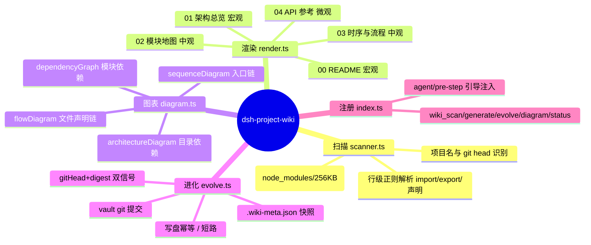
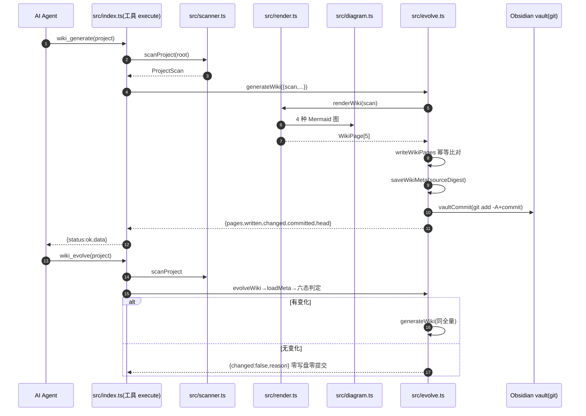

# dsh-project-wiki 自动生成知识库 · 六视角结构化审查报告

> 审查对象：`/home/as-workstation01/Documents/team-kb/项目知识库/@deepseek-ai/dsh-project-wiki/` 下 5 页
> （00-README / 01-架构总览 / 02-模块地图 / 03-时序与流程 / 04-API参考）＋ .wiki-meta.json。
> 对照物：插件 README.md + src/ 6 个源码文件（scanner/diagram/render/evolve/index/types）+ tests + package.json + docs/ 既有评审两份。
> 审查方法：全文逐行比对（非采样）；观点全部可溯源到 文件:行号。

---

## 0. 证据基线（先核验，后评价）

| 证据 | 结论 |
| --- | --- |
| .wiki-meta.json gitHead=f6f32f8；当前 `git rev-parse --short HEAD`=f6f32f8 | 知识库记录的 git head 与当前一致，非"过期" |
| `git status --porcelain` 显示 `?? dsh-plugins/` | **插件源码在 Cerebrate 父仓库中未被 git 跟踪**——gitHead 是父仓库 HEAD 而非插件自身历史；插件任何改动都不会改变 gitHead。这使 evolve 的 head 信号恒等于 meta（不触发），只能靠 digest 触达；同时放大 wiki_status stale 判定盲区（见 E/F、P0-2） |
| diagram.ts 五个函数当前源码均有 `export` 前缀（grep 验证 63/92/131/183/198 行） | 04 页"导出符号"清单**无误**（非知识库错误） |
| `interface PageSnapshot/WikiMeta`（evolve.ts:23,29）被 scanner.ts:177-180 Java 分支正则捕获 | 04 页两处 `类型：class` 为**真误判**（R1），interface 实为 interface |
| tests/index.spec.ts 实际 4 组 6 用例（scanner×2 / diagrams×1 / render×1 / evolve×2） | docs/技术实现方案.md 写"4 组 7 例"与实际**不符**（差 1）；以实测为准 |
| 00 页"10 源文件/1601 行、模块目录 2 个" | 与 scanProject 输出一致（root 3 文件 + src 6 + tests 1 = 10） |

---

# A【AI 阅读完整度】—— 假设新 AI 只读知识库不读代码

## A.1 逐页打分

| 页 | 分 | 能回答 | 不能回答 | 会误解什么 |
| --- | --- | --- | --- | --- |
| 00-README（37 行） | 5/10 | 项目名/规模/技术栈/入口/模块数/5 页导航 | **"这个软件是干什么的"**——全页无一句话业务定位；无工具清单；无使用示例 | 读者以为它只是"一个有 10 个文件的 TypeScript 项目"，不知道它是 DSH 插件、会自动写 Obsidian vault |
| 01-架构总览（64 行） | 4/10 | 目录结构图、tests→src 依赖、BFS import 链 | 真实运行时调用关系；模块职责；设计决策 | 时序图用 `->>` 箭头 + "调用/传递"标签，reader 会当成真实调用链（实为 import 序，其中 3/5 条边是假边） |
| 02-模块地图（84 行） | 6/10 | 每目录文件/行数/声明名/导出符号 | 每个模块**做什么/不做什么**（无职责描述）；为何这样分层 | 根目录标注"根目录（src 顶层）"实际装的是项目根配置（tsdown/vitest/cordis.patch.yml），命名误导；`Config` 导出重复两条 |
| 03-时序与流程（157 行） | 3/10 | 入口 import 链（与 01 重复）；各文件声明清单 | **真实处理流程**——所谓"核心文件处理流程"是声明出现顺序的线性图，非执行序；无数据流（scan→render→write→commit 如何流转完全缺席） | "流程图与代码声明顺序一致"页脚诚实但标题"处理流程"误导：reader 会把 `now→frontmatter→esc→slug→…→readmePage→architecturePage` 当管线执行序（实际 readmePage 是入口函数，声明序≠调用序） |
| 04-API参考（467 行） | 6/10 | 64 条声明：签名/文件:行号/JSDoc 说明；定位能力强 | 导出与内部符号的区分（private helper 与 public API 混排）；参数/返回/错误语义；工具级契约；**调用示例** | `PageSnapshot/WikiMeta` 标成 class；`Config` 同名两条（interface+const）；连 tests 的 `makeProject` 也进 API 清单；签名截断 140 字符（如 saveWikiMeta 定义被切） |

**加权总分：约 4.8/10——"导航可用、语义空洞"。**

## A.2 缺失关键信息清单（新 AI 会答错/答不出）

1. **业务目的**：nothing。00 页只有规模统计，无"生成→写入 vault→git 提交"的主语。
2. **设计决策（why）**：为何代码即文档（ADR-001）、为何 digest（ADR-002）、为何静态文件（ADR-003）、为何正则（ADR-004）——0 覆盖。
3. **数据流**：scan→render→write→commit 的副作用链与 evolve 短路逻辑——0 覆盖。
4. **配置说明**：Config 四个字段（vaultDir/kbRoot/injectGuidance/autoCommit）+ cordis.patch.yml 挂载——知识库内 0 覆盖（README 有，但 00 页不引用）。
5. **使用示例**：`wiki_generate project=...`、`wiki_evolve force=true` 如何调用——0 覆盖。
6. **已知限制**：解析精度边界、排除规则（node_modules/256KB/锁文件不触发 evolve）、stale 盲区——0 覆盖。
7. **质量与运维**：测试策略、已知缺陷 R1-R4、排障决策树——0 覆盖。
8. **变更历史**：只有 frontmatter git_head，无面向人的 changelog。

**A 改进建议**：
- render.ts 的 readmePage 增加取自 package.json 的 `description`（★ 可自动）；
- 01/03 页移除假边（改 diagram.ts）；03 页改为真实数据流（见 B）；
- 04 页区分「导出（可 import）」/「内部 helper」，签名不截断或标注截断；
- 每页页脚加"已知限制"一行（★ 静态文本 + 人工清单维护）。

---

# B【思维链与脑图】—— 因果链、真实调用关系、脑图与时序图

## B.1 核心因果链（触发 → 扫描 → 渲染 → 进化 → 提交）——知识库没有画出来

真实链条（源码证据）：

```text
agent 调 wiki_generate (index.ts:apply 注册 defineTool)
  → resolveProject(project,cwd) index.ts:96
  → scanProject(root) scanner.ts:230   [目录遍历/排除/正则解析/git head]
  → renderWiki(scan) render.ts:266     [5 页渲染；内部调 diagram 4 函数]
  → generateWiki (evolve.ts:133)
      → writeWikiPages 逐页比对幂等写盘 evolve.ts:89
      → saveWikiMeta(sourceDigest) evolve.ts:106
      → vaultCommit(git add -A + commit) evolve.ts:118
agent 调 wiki_evolve → scanProject → loadMeta(evolve.ts:73)
  → 六态判定 (force/无 meta/head 变/path 变/digest 变/无变化) evolve.ts:180-204
  → 变化才 generateWiki；无变化零写盘零提交
```

## B.2 模块真实调用关系（与 03 页对比）

| 源 | 真实 import（本地） | 03 页画的边 | 判定 |
| --- | --- | --- | --- |
| index.ts | → scanner / diagram / render / evolve（+底部 type 再导出 './types'，扫描器未捕获） | index→scanner | ✅ 真 |
| scanner.ts | → types | **scanner→diagram** | ❌ **假边**（scanner 不 import diagram） |
| diagram.ts | → types | **diagram→render** | ❌ **假边**（diagram 不 import render） |
| render.ts | → diagram / types | **render→evolve** | ❌ **假边**（render 不 import evolve） |
| evolve.ts | → render / types | evolve→types | ✅ 真 |

**结论：03/01 页的"入口调用时序图"，5 条链边只有 2 条是真实 import 边，其余 3 条是 BFS 排队序 + 兜底标签"调用/传递"拼出来的。**
根因：diagram.ts:150-161 对**相邻 BFS 节点对**找 import 边，找不到就写 `edge ?? '调用/传递'`——把"import 线性化"伪装成"调用链"。

## B.3 思维脑图（Mermaid mindmap，建议进 01 页）



## B.4 真实端到端 sequenceDiagram（供 03 页替换）



**B 改进建议（改动点 diagram.ts）**：
1. sequenceDiagram **只画真实 import 边**：找不到边就不画箭头，改为 `Note` 注明"以下为 import 顺序，非运行调用"；或按真实调用（tool execute 入口 → scan/generate/evolve）重写参与者。
2. flowDiagram 改名"声明清单"，标题去掉"处理流程"；或升级为「读真实调用」：利用 import 解析出的模块间边 + 声明名匹配（此项目规模小，可先做前者）。
3. 01 页入口时序图与 03 页完全重复——去重：01 只放架构/依赖图，03 放数据流 + 行为流程。

---

# C【开源 wiki 精细化设计】—— VitePress/Docusaurus/MkDocs/Wiki.js/Diataxis 方法论

## C.1 信息架构惯例（宏观→微观的成熟形态）

| 框架 | 顶层结构 | 与本插件对照 |
| --- | --- | --- |
| VitePress | Home → Guide(Getting Started/深入) → Reference(Config/API) | 现有 00≈Home、01-03≈Guide、04≈Reference，**缺 Getting Started 与 FAQ/Troubleshooting** |
| Docusaurus | Docs(教程→指南→参考) / Blog / Changelog | 缺 changelog 页 |
| MkDocs | Getting Started → User Guide → API → About | 缺 About（项目定位）与 User Guide |
| Wiki.js | 树形目录 + 分类 + 标签 | 本插件用 frontmatter tags 已可，缺目录索引页 |
| **Diataxis（方法论内核）** | **Tutorials(学)** / **How-to(做)** / **Reference(查)** / **Explanation(懂)** | 现有 5 页 ≈ Reference(04) + 部分 Explanation(01/02)；**Tutorials 与 How-to 完全缺失**，Explanation 只有"是什么"没有"为什么" |

**一句话诊断：现有 5 页是"纯 Reference 金字塔"，缺 Diataxis 的"学(上手教程)"与"做(运维 How-to)"两层，导致新读者"能查不能学"。**

## C.2 图表使用惯例（Mermaid 在知识库中的正确姿势）

| 图型 | 适用 | 本插件现状 |
| --- | --- | --- |
| flowchart/erDiagram | 实体结构、模块依赖（静态事实） | ✅ architecture/dependency 合格 |
| sequenceDiagram | **经核实的运行时调用**（可信事件序） | ❌ 拿 import 序冒充调用序（B.2） |
| flowchart | **真实处理流程**（分支/条件/循环可见） | ❌ 声明出现序直连成"A→B→C"管线，无分支无循环无调用语义 |
| mindmap | 概念分层（人脑导航） | ❌ 未使用（建议 01 页补，见 B.3） |
| quadrantChart | 二维评价（如 复杂度×价值） | 未使用（可选） |

**惯例要点**：结构图标"静态 import 依赖"；行为图必须标注"经代码验证的调用序"，无法验证就降级为列表，绝不用箭头暗示调用。

## C.3 可直接套用的「项目知识库页面模板清单」

| 页序 | 模板名（Diataxis 角色） | 标准内容清单 |
| --- | --- | --- |
| 00 | Home/README（Tutorials 入口） | 一句话定位（★）· 规模/技术栈/入口（★）· 功能卡片×5 工具（★）· 快速上手 3 步（◐）· 双链导航（★）· 已知限制脚注（◐） |
| 01 | Getting Started（Tutorial） | 安装/挂载 cordis.patch.yml（★）· 配置表（★）· 首次生成示例（◐）· 验证方法（◐）· 常见报错速解（◐） |
| 02 | Explanation·架构（懂） | 架构图（★）· 依赖图（★）· 模块职责/边界表（◐）· 设计决策 ADR 摘要（○）· 思维脑图（★） |
| 03 | Reference·模块（查） | 每目录职责一句话（◐）· 文件表（★）· 导出清单（★） |
| 04 | Reference·数据流与流程（查/懂） | 真实调用时序（★修正）· 数据流图含副作用边（◐）· 演化判定六态（◐）· 关键流程分支说明（◐） |
| 05 | Reference·API/工具契约（查） | 工具参数/返回/错误契约表（★）· 配置 schema 表（★）· 内部符号（★）· 示例调用（◐） |
| 06 | How-to·运维 FAQ（做） | 排障决策树（◐）· FAQ 表（◐）· 已知限制清单（○ 维护）· 性能提示（◐）· 提交策略（◐） |
| 07 | Changelog/Roadmap（新鲜度） | git log 自动摘要（◐）· 版本里程碑（◐）· 路线图（○） |

★=扫描/渲染可自动；◐=LLM 可半自动补语义；○=必须人工

**C 改进建议**：把 01-03 合并/重排为"架构(02)+数据流(04)"，新增"上手(01)"与"运维 FAQ(06)"两页；每页头加 Diataxis 角色标注一句话（"本节教你_ / 本节回答_ / 本节可查_"），引导 reader 按需跳转。

---

# D【产品经理视角】—— 用户、价值主张与产品化知识库

## D.1 用户与价值（与 docs/任务D 结论一致，补证据）

- 直接用户：DSH 会话内 AI Agent（要确定性结构事实，不猜代码）；最终读者：Obsidian 里的开发者/新人；放大方：团队知识管理。
- 价值主张三支柱：免费（MIT+Obsidian 原生 Mermaid）、自动（代码即语言，scanner 不猜测）、1:1 同步（gitHead+digest 双信号+幂等）。
- **KB 内没有任何一页传达这三支柱**——00 页只有统计数字；产品包装层 100% 缺失。

## D.2 理想产品知识库结构 vs 现有（差距表）

| 理想板块（docs/任务D 8 板块） | 现有覆盖 | 差距 | 可行性 |
| --- | --- | --- | --- |
| ① 用户价值 Why | ❌（00 页一句"自动生成"） | 缺电梯宣言/痛点/开源对比 | 人工（素材在 README"为什么不用开源 wiki"） |
| ② 目标用户与场景 | ❌ | 缺画像与 A/B/C/D 场景 | 人工 |
| ③ 功能卡片 | ⚠️ 半（README 工具表；index.ts description） | 知识库内无工具卡片 | ★ 可从 5 个 defineTool 注册表自动渲染 |
| ④ 使用流程 | ⚠️ 半（README 3 步 + guidance 注入） | 缺快速上手/日常/高级三档 | ◐ 模板一次撰写 |
| ⑤ 配置指南 | ⚠️ 半（README 手写；Config z.object 有注释） | 知识库无配置页 | ★ 从 Config schema 自动渲染（v0.2 落地项） |
| ⑥ FAQ | ❌（踩坑在团队记忆） | 缺 FAQ 页 | 人工为主（素材半小时可整理） |
| ⑦ 变更日志 | ⚠️ 弱（仅 .wiki-meta.json + git 历史） | 缺人读 changelog 页 | ◐ git log+meta 可生成 |
| ⑧ 成功指标 | ❌ | 缺口径与基线 | 定义人工；数据半自动（stale/生成数已可采） |

## D.3 产品视角落地建议（mini-roadmap）

1. 立即人工：README/vault 补"产品说明"（① ② ⑥ ⑧，素材现成，<1 天）。
2. v0.2：render.ts 新增 `toolsPage`（从工具注册表）+ `configPage`（从 Config schema），随 evolve 自动保鲜——这是性价比最高的一步。
3. v0.3：`changelogPage`（git log+meta）；`wiki_status` 追加成功指标字段（生成次数/演进次数）。

---

# E【技术经理视角】—— 技术方案文档对照（docs/技术实现方案.md 已先行，本报告核验并补充）

## E.1 理想技术方案 8 节 vs 现有 5 页

| 节 | 现有 | 缺口 | 可行性 |
| --- | --- | --- | --- |
| 1 ADR（代码即文档/digest/静态文件/正则） | 00 页 2 行理念；无论证 | 决策背景/备选/代价全缺 | ○（README/注释可提取碎片 ◐） |
| 2 模块职责与边界 | 02 有文件+导出，无职责/边界 | "做什么/不做什么/读写面"表 | ◐ @module 注释可提取；边界人工 |
| 3 数据流 | 03 是 import 链+声明链，非数据流 | 写盘/提交/短路副作用边全缺 | ◐ 骨架自动+分支人工 |
| 4 接口契约 | 04 是内部函数签名 | defineTool 参数/返回/错误语义/配置表 | ★ 直接从 index.ts 提取 |
| 5 质量保障 | 无 | 测试矩阵/审查/性能热点/风险 | ◐ 用例名可提取；门禁人工 |
| 6 部署挂载 | 02 仅文件名 | 构建→挂载→验证步骤 | ★ 文件内容直嵌 |
| 7 运维排障 | 无 | FAQ/决策树（evolve 不触发等） | ◐ 已知行为可从源码生成，场景人工 |
| 8 扩展路线 | 无 | 路线图 | ◐ 缺陷型可列，方向型人工 |

## E.2 本报告新核验的技术事实（技术经理必须知道）

| # | 问题 | 证据 | 等级 |
| --- | --- | --- | --- |
| T1 | **wiki_status.stale 只看 gitHead 不看 digest**（evolve.ts:228-241：`stale: meta ? meta.gitHead !== scan.gitHead : true`） | 且本插件挂父仓库并**未被 git 跟踪**（`?? dsh-plugins/`）→ gitHead 恒等于 meta → stale 永远 false，即使改了源码 | **P0** |
| T2 | **sequenceDiagram 3/5 条边为假边**（diagram.ts:150-161 兜底"调用/传递"） | B 节逐边核验 | P0 |
| T3 | **flowDiagram 声明序冒充处理流程**（diagram.ts:183-195 按声明出现序直连） | 03 页 render.ts 流程把 now() 画成 readmePage 的前置步骤 | P0 |
| T4 | **interface 被 Java 分支误判 class**（scanner.ts:177-180 javaCls 正则先于 TS interface 匹配） | 04 页 PageSnapshot/WikiMeta 类型=class | P0 |
| T5 | **测试秒级脆弱**：ev3.written===0 依赖同一秒内 now() 相同（render.ts:17-19 秒级时间戳 + evolve 幂等按内容比对） | 跨秒 force 会重写 5 页时间戳→written=5→断言红 | P1 |
| T6 | frontmatter created==updated==now | created 应为首代时间（追溯性） | P1 |
| T7 | 签名截断 140 字符 | 04 页 saveWikiMeta 定义被切 | P2 |
| T8 | module 级 `/** */` 文件头注释不被提取（parseSource 文件 doc 只认 `//`/ `#`，scanner.ts:87-99） | 02 页无模块职责来源 | P1 |
| T9 | vaultCommit `git add -A` 全量提交整个 vault | 无关改动被打包进 wiki 提交 | P1 |
| T10 | evolve 判定不含配置类文件（改 tsconfig/cordis.patch.yml 不触发） | scanner SKIP 规则；设计取舍需文档化 | P2（文档） |

## E.3 质量与性能

- 测试 4 组 6 例（scanner 2 / diagrams 1 / render 1 / evolve 2），全绿；缺 golden 快照、Python/Java fixture 断言、边界用例（空目录/256KB/无 git）。
- 性能：scanProject 全同步 fs + 每行 6+ 正则（scanner.ts:104-182），大仓库阻塞事件循环；已有 readBounded 256KB + SKIP 三表保护。建议后续跑 code_review_bench/profile 出基线（docs/技术实现方案 §5.3 亦同）。
- 建议质量门禁：P0=类型/测试红/幂等断言失效；P1=T1-T6、解析回归；P2=golden/单语言 fixture/性能基线。

---

# F【需求分析经理视角】—— 需求文档要素与需求追溯

## F.1 需求要素 vs 可追溯性

| 需求文档要素 | 现状 | 能否支撑需求追溯 |
| --- | --- | --- |
| 背景与目标 | package.json description + README 核心理念（知识库外） | ⚠️ 弱：目标散落 README，知识库内无"背景页"，追溯需人工翻 README |
| 干系人 | 无 | ❌ |
| 功能需求 | 5 工具已实现（index.ts:104-214），可从 defineTool 注册表生成功能需求清单 | ✅ **强**：功能-实现 1:1（每个工具=一个 execute 行为） |
| 非功能需求 | 确定性强（header 承确定性）、性能有 256KB/边数 80/节点 14 上限、幂等（tests） | ⚠️ 中：约束散在 scanner/diagram 常量，无文档化 |
| 验收标准 | 无文档化，但**可测**：tests/index.spec.ts 6 例即隐式验收（5 页/前端注释/幂等/提交） | ⚠️ 中：验收可从测试推断但无显式清单 |
| 风险 | 无 | ❌（R1-R4、T1-T10 是实际风险，只存在于本报告与 docs） |

## F.2 差距与建议

1. **功能需求可自动生成**（★）：5 个 defineTool 的 name/description/parameters 就是功能需求清单——建议 04 页补"工具契约"节即同时完成"功能需求可追溯"。
2. **非功能约束半自动**（◐）：scanner 的 SKIP 三表、256KB、图上限 80/14 可静态提取为"约束表"。
3. **验收标准半自动**（◐）：测试用例名（it 文案）可生成"验收条目"；门禁阈值人工定。
4. **背景/干系人/风险人工**（○）：建议人工维护一页"需求与风险"（可并入 06 运维页），否则后续迭代无法回答"这个功能是为什么加的"。

**一句话：需求追溯目前只能靠"工具注册表 + 测试"逆向还原，正向需求文档（背景/目标/干系人/风险）在知识库内是空白。**

---

# 【整合优化方案】

## 1. 优化后页面结构（8 页，每页小节清单）

| 页 | 名称 | 小节清单 | 主要来源 |
| --- | --- | --- | --- |
| 00-README | 总览 | 一句话定位 · 规模/技术栈/入口 · 功能卡片(5 工具) · 快速上手 3 步 · 双链导航 · 已知限制脚注 | ★ + ◐ |
| 01-快速上手 | 使用教程（Tutorial） | 安装挂载 · 配置表 · 首次生成示例(命令行) · 验证 · 常见报错 | ★ + ◐ |
| 02-架构总览 | 架构与决策（Explanation） | 架构图 · 依赖图 · 思维脑图 · 模块职责/边界表 · ADR 摘要 | ★（脑图） + ◐（职责/ADR） + ○（决策论证） |
| 03-模块地图 | 模块参考（Reference） | 每目录职责一句 · 文件表 · 导出清单 | ★ + ◐ |
| 04-数据流与流程 | 行为与数据流 | 真实调用时序(修正) · 数据流图(含写盘/提交/短路) · 演化六态 · 关键流程分支 | ★（修正图）+ ◐（分支说明） |
| 05-API参考 | 工具契约与接口 | 工具参数/返回/错误 · 配置 schema · 导出符号(区分导出/内部) · 示例 | ★ |
| 06-质量与运维 | 运维 FAQ（How-to） | 测试矩阵 · 已知限制 · 排障决策树 · FAQ · 风险清单 · 性能提示 | ◐ + ○ |
| 07-变更日志 | Changelog/Roadmap | git log 摘要 · 里程碑 · 路线图（需求追溯锚点） | ◐ + ○ |

对应关系：现有 01+03 的重复时序图拆并到 04；新增 01(Tutorial) 与 06(How-to) 补齐 Diataxis；02 吸收 ADR 摘要成为"懂"层。

## 2. 每页内容来源划分

| 来源 | 内容 | 落地载体 |
| --- | --- | --- |
| ★ 代码自动提取 | 规模/技术栈/入口/文件表/导出符号/架构图/依赖图/工具契约表/配置 schema/排除与上限约束/真实 import 边 | scanner.ts/render.ts/diagram.ts 现有能力 + 新增 defineTool/Config 识别 |
| ◐ LLM 补语义 | 模块职责一句话（@module 注释+README 归纳）、ADR 摘要、FAQ 证据条目、流程分支说明、changelog 摘要、脑图 | 可选 LLM 增强 pass（保留确定性骨架，纯增量字段），或人工模板一次撰写 |
| ○ 人工定义 | 业务定位/价值主张、目标用户与场景、验收标准口径、风险清单、路线图方向、submit 策略 | 知识库内人工维护页（00 定位句 / 06 风险 / 07 roadmap），evolve 不覆盖 |

## 3. P0/P1/P2 优先级 + 实现要点

| 级别 | 项 | 实现要点（改哪里） |
| --- | --- | --- |
| **P0** | 1. scanner TS interface 误判 class | scanner.ts parseSource：在 javaCls 分支**之前**增加 TS 非导出 `interface|type` 匹配（kind 记 interface/type），修复 04 页类型失真 |
| **P0** | 2. wiki_status stale 盲区 | evolve.ts wikiStatus：stale = gitHead 不同 **OR** sourceDigestOf(scan) !== meta.sourceDigest（双信号）；并补"项目未被 git 跟踪"提示 |
| **P0** | 3. sequenceDiagram 假边 | diagram.ts：只画真实 import 边；无真实边时输出 Note"import 顺序，非调用链"，去掉 `edge ?? '调用/传递'` 兜底 |
| **P0** | 4. flowDiagram 语义 | diagram.ts flowDiagram 改名"声明清单"并改标题；有真实调用证据（import 边+声明名匹配）时才可用箭头 |
| **P0** | 5. 测试秒级脆弱 | render.ts：renderWiki(scan, now?) 时钟注入；tests 断言改为"内容相同则 written=0"而非依赖同一秒 |
| **P1** | 6. 工具契约/配置自动页 | render.ts 新增 apiPage 章节或独立 page：从 index.ts defineTool(name/parameters/execute 返回) + Config z.object 遍历渲染契约表（★性价比最高） |
| **P1** | 7. 模块职责半自动 | scanner.ts 文件 doc 提取支持 `/** */` 文件头（T8）；render.ts moduleSection 前置"职责"一行 |
| **P1** | 8. frontmatter created/updated 分离 | render.ts：created 读 meta 首代时间，updated 每次刷新；消除追溯失真 |
| **P1** | 9. 02/04 去重与标注 | moduleSection 导出列表按 name 去重（Config×2）；declEntry 按 name+kind 唯一；API 页分"导出/内部"两组，可选排除 tests |
| **P1** | 10. vaultCommit 定向提交（可选） | evolve.ts vaultCommit 支持收窄到 kbRoot/<project>/（git add -- 目录），避免无关改动入库 |
| **P2** | 11. 快速上手页 | 模板一次撰写（01-快速上手），render 输出固定结构，evolve 只刷新可自动字段 |
| **P2** | 12. changelog 页 | git log + .wiki-meta.json 自动摘要（v0.3） |
| **P2** | 13. FAQ/风险页 | 人工整理进 06；素材=本报告 T1-T10 + docs 两份 + 团队记忆 |
| **P2** | 14. 性能 | scan 异步化/增量扫描（git diff 文件清单）；diagram 的 scan.files.find 建立 relPath→file 索引（sequenceDiagram 线性查找 O(n) 高发） |
| **P2** | 15. 多项目索引/语义可选 | vault kbRoot 下生成"项目索引页"；可选 LLM 摘要字段（保留确定性骨架） |

## 4. 落地顺序

1. **阶段一（半天，正确性）**：P0-1..5 全部修复 → 重跑 code_review_test（既有 6 例+新增回归断言：interface 判型/假边输出/stale 双信号/时钟注入）→ wiki_evolve force 重生成 5 页 → 核对 04 类型、03 图。
2. **阶段二（1-2 天，完整性）**：P1-6/7/8/9 → 形成 8 页框架（01/04/06 先以模板产生）→ 工具契约表、配置表、模块职责自动落页。
3. **阶段三（迭代，产品化）**：P1-10 提交策略 → P2-11/12 changelog/快速上手 → P2-14 性能（code_review_bench/profile 建立基线后再动）→ P2-15 索引页。
4. **闭合校验**：每阶段后运行 dsh-code-review（lint/format/test/bench/profile/report）质量门禁；wiki_evolve 验证幂等（无变化零写盘零提交）；人工核对 vault git log 提交消息。

## 5. 一句话结论

**现有知识库是合格的"微观事实金字塔"（结构可信、可追溯），但缺两层：语义层（业务目的/设计决策/数据流/使用示例）与运维层（FAQ/排障/风险）——根因是 scanner 只产"what"不产"why/how"；本方案以 P0 修复 4 处正确性硬伤 + P1 自动补"工具契约/配置/职责" + P2 人工补齐"上手/运维/changelog"，即可从 4.8 分知识库升级为团队可依赖的活文档。**

---

## 附：证据索引（本报告所有断言可回查）

| 断言 | 证据 |
| --- | --- |
| 插件未被 git 跟踪 | `git status --porcelain` → `?? dsh-plugins/` |
| diagram.ts 5 函数均 export | grep `^(export )?function (architectureDiagram|dependencyGraph|sequenceDiagram|flowDiagram|pickEntry)` 命中 63/92/131/183/198 |
| interface 误判 class | scanner.ts:177-180 javaCls 正则；04 页 PageSnapshot/WikiMeta 类型=class |
| sequenceDiagram 假边机制 | diagram.ts:150-161（`edge ?? '调用/传递'`）；真实 import 见各文件头部 import 语句 |
| flowDiagram 声明序 | diagram.ts:183-195（decls.forEach 顺序连线）；03 页页脚自认"与代码声明顺序一致" |
| stale 只看 gitHead | evolve.ts:228-241 |
| vaultCommit 全量 | evolve.ts:118-131（`git add -A`） |
| 时间戳秒级 | render.ts:17-19；测试 ev3.written===0（tests/index.spec.ts evolve 组） |
| 文件头 `/** */` 不提取 | scanner.ts:87-99（模块 doc 只认 `//`/ `#`） |
| 工具注册/参数 schema | index.ts:104-214 |
| 配置 schema | index.ts:44-49 |
| 测试 4 组 6 例 | tests/index.spec.ts（scanner×2/diagrams×1/render×1/evolve×2） |
| 排除规则/上限 | scanner.ts:24-37（SKIP 三表）、48-57（256KB）；diagram.ts:72-78（80 边）、139（14 节点） |
