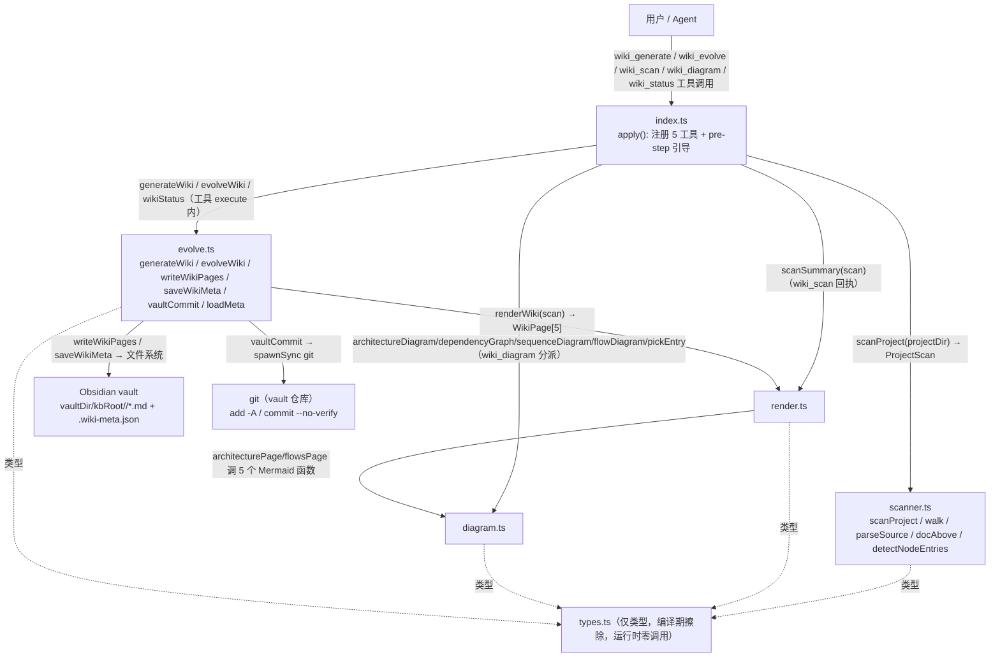
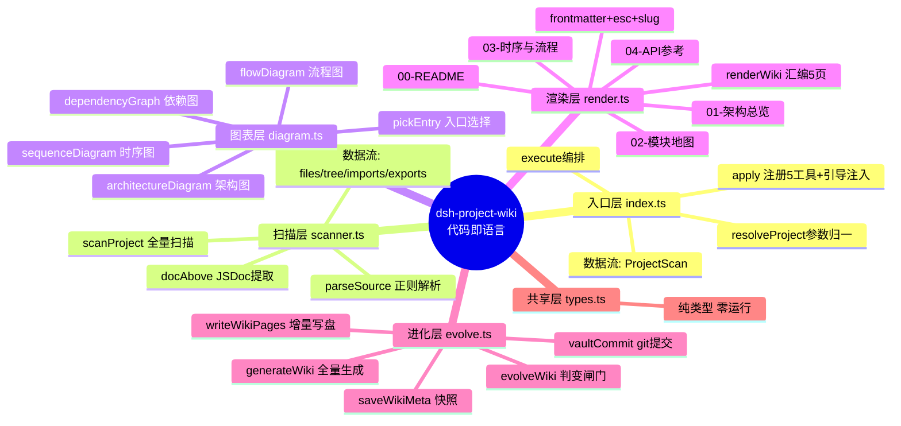
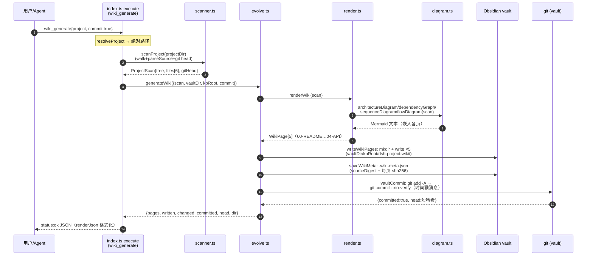

# 任务B · dsh-project-wiki 项目思维链与思维脑图

> 证据来源：`src/{index,scanner,diagram,render,evolve,types}.ts`（6 文件 1379 行）全文精读 +
> `README.md` + 知识库 00–04 页（git head `f6f32f8`）+ `tests/index.spec.ts`。
> 检索结论：团队记忆/知识库无同主题命中（cerebrate 分数 <0.02、knowledge 无专项文档、obsidian 401 未授权），本报告全部结论来自代码证据，可逐条溯源到 文件:行号。

---

## 1. 项目核心思维链（用户触发 → 知识库落盘 → git 提交）

### 1.1 主链路：wiki_generate

因果链（每步 → 模块 → 关键函数）：

1. **用户/Agent 发工具调用** `wiki_generate(project?, commit?)`
   → 入口层 `src/index.ts` 的 `apply(ctx, config)` 注册的 `tools.generate`（defineTool）
   → 触发 `execute(args)`（index.ts:113-138）。
2. **参数解析**：`resolveProject(args.project, process.cwd())`（index.ts:75-77）
   → 相对路径/缺省 cwd 归一为绝对路径。
3. **代码扫描**：`scanProject(projectDir)`（scanner.ts:250-291）
   - 递归 `walk()` 遍历目录树（跳过 node_modules/.git/dist 等，scanner.ts:33-46）
   - 逐文件 `readBounded`（>256KB 跳过）→ `parseSource` 正则级解析 import/export/声明 → `docAbove` 提取 JSDoc
   - `detectNodeEntries` 读 package.json main/bin → `detectProjectName` 读工程名
   - `git rev-parse --short HEAD`（execFileSync）取 gitHead
   - **产出：`ProjectScan`**（root/name/gitHead/languages/entries/tree/files[]/totalFiles/totalLines/excluded/scannedAt）。
4. **知识库渲染**：`generateWiki({projectRoot, vaultDir, kbRoot, scan, commit})`（evolve.ts:187-224）
   → 第 1 步调用 `renderWiki(scan)`（render.ts:262-272）：
   - 依次渲染 5 页：`readmePage`(00) / `architecturePage`(01) / `modulesPage`(02) / `flowsPage`(03) / `apiPage`(04)
   - 各页内嵌 Mermaid：01→`architectureDiagram+dependencyGraph+sequenceDiagram`；03→`sequenceDiagram+flowDiagram`（diagram.ts）
   - frontmatter（created/updated/git_head/tags）由 `frontmatter→esc/slug` 生成。
5. **增量落盘**：`writeWikiPages(vaultDir, kbRoot, scan.name, pages)`（evolve.ts:141-157）
   - `wikiDirFor`（expandHome + join vautlDir/kbRoot/<project>）→ `mkdirSync recursive`
   - 逐页比对旧内容，相同跳过；`written`/`changed` 计数。
6. **快照固化**：`sourceDigestOf(scan)`（relPath:sha256 排序聚合哈希）+ `saveWikiMeta(...)`（evolve.ts:159-172）
   → 写 `.wiki-meta.json`（含 sourceDigest + 每页 sha256）——下一次 evolve 的判变依据。
7. **git 提交**：`vaultCommit(vaultDir, message)`（evolve.ts:174-186）
   - `expandHome` → 校验 vault 根有 .git → `git add -A` → `git status --porcelain` 判空
   - 有变更 → `git commit -m "wiki: <name> 知识库自动更新 @ <ISO 时间戳> (git <head>)" --no-verify`
   - 提交信息含时间戳，遵循 obsidian-knowledge-git 契约。
8. **工具响应**：`execute` 组装 `{pages/bypes, written, changed, committed, vaultHead, dir, summary}` JSON
   → `renderJson`（index.ts:66-68）格式化返回模型。

### 1.2 分支链路：wiki_evolve（增量进化）

触发 → `tools.evolve.execute` → `scanProject`（同主链）→ `evolveWiki(...)`（evolve.ts:226-276）：

1. `wikiDirFor` + `loadMeta(dir)` 读上次快照（.wiki-meta.json）。
2. **判变决策**（顺序短路）：
   - `force=true` → 重生成（reason="force 重生成"）
   - 无快照 → 首次生成
   - `meta.gitHead !== scan.gitHead` → git head 变化
   - `meta.sourceRoot !== projectRoot` → 项目路径变化
   - `sourceDigestOf(scan) !== meta.sourceDigest` → 源码内容变化
   - 全部不满足 → **短路返回** `{changed:false, committed:false, head}`，零写入零提交。
3. 变化时 → 完整走 `generateWiki`（含 renderWiki → writeWikiPages → saveWikiMeta → vaultCommit）。

### 1.3 另外三个工具的轻量链路

- **wiki_scan**：`execute → scanProject → scanSummary(scan)`（render.ts:274-295，模块聚合 JSON）。不写盘。
- **wiki_diagram**：`execute → scanProject → 按 type 分派 architectureDiagram / dependencyGraph / sequenceDiagram(用 pickEntry 选入口) / flowDiagram`。不写盘。
- **wiki_status**：`execute → scanProject → wikiStatus(vaultDir, kbRoot, scan)`（evolve.ts:278-291）→ `loadMeta` 对比 gitHead 得 `stale`。不写盘。

**思维链一句话**：工具参数 → 绝对路径 → 文件系统扫描（提取代码自身的语句）→ ProjectScan 结构化 →
renderWiki 分层渲染（内嵌 Mermaid）→ 增量写盘 + digest 快照 → vault git 提交 → JSON 回执；
evolve 在此链前插一道「快照判变闸门」，无变化即短路为零副作用。

---

## 2. 模块间真实调用关系（调用方向 + 数据传递，非 import 关系）

> 判定依据：逐文件读函数体中的**函数调用点**（execute 闭包、renderWiki、generateWiki 等），
> 并排除编译期消失的 TS 类型-only import。

### 2.1 调用图（真实）

### 2.2 关键真实数据流（谁产出 → 谁消费）

| 序号 | 数据 | 生产方 | 消费方 |
| --- | --- | --- | --- |
| 1 | 用户参数 {project, commit, force, type, file} | 模型/用户 | index.ts 各 execute（resolveProject 归一） |
| 2 | ProjectScan（tree/files/gitHead/digest 素材） | scanner.scanProject | index.execute → evolve/render/diagram |
| 3 | WikiPage[5]（含 frontmatter+Mermaid 文本） | render.renderWiki | evolve.writeWikiPages / saveWikiMeta |
| 4 | 写盘结果 {written, changed} | evolve.writeWikiPages | generateWiki → 工具响应 |
| 5 | sourceDigest（relPath:sha256 排序聚合） | evolve.sourceDigestOf | saveWikiMeta / evolveWiki 判变 |
| 6 | 提交结果 {committed, head} | evolve.vaultCommit | generateWiki/evolveWiki → 工具响应 |
| 7 | stale 判定（gitHead 对比） | evolve.wikiStatus | wiki_status 工具回执 |

### 2.3 跨模块方向性要点（与直觉相反处）

- **index.ts 是唯一的「编排入口」**：5 个工具的 execute 全部直接调 scanner/evolve/diagram/render，
  **index 不经过 evolve 也能直接用 diagram**（wiki_diagram 独立于 generate 链路）。
- **evolve → render → diagram 是深度方向的真实调用**（generateWiki 调 renderWiki，renderWiki 的 page 函数调 diagram 函数）。
- **scanner 是完全独立的叶节点**：只 import types，**从不被 render/evolve/diagram 调用**，只被 index 的 execute 调用。
- **types.ts 零运行职责**：全部是 interface（SourceFile/Declaration/ModuleNode/ProjectScan/WikiPage），
  编译后擦除，任何"types 参与运行调用"的说法都是假的。

---

## 3. 项目思维脑图（Mermaid mindmap）

---

## 4. 真实端到端时序（用户 → 工具 → scanner → render → evolve → vault/git）

> 与知识库 03 页不同，本图每个箭头都有函数级代码依据（见右侧标注）。

**evolve 分支的差异点**（图中省略以聚焦主链路）：evolveWiki 在入 render 前先 `loadMeta` 做判变闸门，
任一条件（force / 无快照 / gitHead≠ / sourceRoot≠ / sourceDigest≠）不满足即短路返回
`{changed:false, committed:false}`，**零文件写入、零 git 提交**（evolve.ts:242-253）。

---

## 5. 知识库 03 页问题严重度评估

### 5.1 问题定位：03 页两类图的数据源错位

03 页（`03-时序与流程.md`）由 `flowsPage`（render.ts:187-205）生成：入口时序图 =
`sequenceDiagram(scan, entry)`，核心文件流程图 = `flowDiagram(scan, f.relPath)`。

- **时序图**（diagram.ts:117-163）：从入口文件出发，沿**本地 import** BFS 展开，箭头标注 = import spec
  （能找到匹配文件时）或兜底文本 `"调用/传递"`（找不到时，diagram.ts:155）。
  **输入只有 import 列表，没有任何运行时调用信息**。
- **流程图**（diagram.ts:165-189）：把单个文件**顶层声明的物理出现顺序**（`declarations` 数组序）
  逐对连边 `decls[i-1] --> decls[i]`，节点文案 = "声明名 — 文档摘要"。
  **输入只有声明顺序，与调用/数据流无关**。03 页脚注自认："流程图与代码声明顺序一致"。

### 5.2 严重度量化（对 03 页逐边核验）

**入口时序图**（6 参与者，5 条跨模块箭头）：

| 箭头 | 事实核验（代码依据） | 真伪 |
| --- | --- | --- |
| index → scanner "./scanner" | index.ts:15 import；execute 确实调 scanProject | ✅ 真 import 且真调用 |
| scanner → diagram "调用/传递" | scanner.ts 只 import types，**无任何 diagram 调用** | ❌ 假调用 |
| diagram → render "调用/传递" | diagram.ts 只 import types；**真调用方向相反：render→diagram** | ❌ 假调用且方向反 |
| render → evolve "调用/传递" | render.ts 不 import evolve；**真调用方向相反：evolve→render** | ❌ 假调用且方向反 |
| evolve → types "./types" | evolve.ts:15 import types（**仅类型**）；"types 被调用"无运行事实 | ❌ 假调用（类型擦除） |
| types → SourceFile()/Declaration()/ModuleNode()/ProjectScan() | types.ts 全是 **interface**，无函数无构造器 | ❌ 伪构造器调用 |

⇒ 5 条跨模块箭头中 **3 条纯假、2 条方向与真实相反**，正确率 0/5。真实调用方向（evolve→render→diagram）
在 03 页中被画成反向（render→evolve、diagram→render），**读者据此建立的因果模型与代码相反**。

**核心文件流程图**（5 文件，边 = 声明相邻顺序）：
- render.ts 链 9 节点 8 边：仅 `frontmatter→esc` 恰好真实且方向正确，其余 7 边（now→frontmatter、
  esc→slug、slug→statsLine、countModules→code、code→readmePage〔真实是 readmePage→code，反向〕、
  readmePage→architecturePage〔两点均由 renderWiki 编排，互不调用〕、architecturePage→moduleSection）全为声明顺序假边。
- evolve.ts 链 9 节点 8 边：**全部假**（PageSnapshot→WikiMeta 是两个相邻 interface；实际编排者 generateWiki
  调用 renderWiki/writeWikiPages/saveWikiMeta/vaultCommit，链中完全未出现）。
- index.ts / scanner.ts 链同理：index 链把 name→inject→Config→guidance→renderJson→presentCall→resolveProject→apply
  串成管线，实际 apply 是 cordis 插桩入口、execute 才是编排；scanner 链 isSkippedDir→readBounded→…→scanProject
  与真实调用（scanProject 调 walk/parseSource/detectNodeEntries）结构不符。

⇒ 流程图系统性伪边：箭头 ≈ 声明位置相邻，**信息量 ≈ 0（声明列表本身已等价）**，且把"辅助函数、page 生成、
入口编排"三类职责抹平成一条线性流水线，掩盖了 renderWiki 才是真实编排枢纽的事实。

### 5.3 严重度评级与阅读影响

**评级：高（时序图）+ 中高（流程图），根因是能力边界而非渲染 bug。**

1. **误导性 > 缺失性**：03 页不是"缺图"而是"给了确定但错误的图"。按 03 页导读，读者会认为 generate 的因果链是
   index→scanner→diagram→render→evolve，而真实是 index→scanner(扫描)、index→evolve→render→diagram(渲染)，
   两条链**在关键处方向相反**，会导致对"谁产出页面/谁提交 git"的心智模型直接出错。
2. **跨页自相矛盾**：01 页（架构图、依赖图，基于 import，语义正确）与 03 页（伪时序/伪流程）对同一批文件的描述冲突，
   削弱整份知识库 1:1 的可信承诺（README 宣称"代码即语言、1:1 不漂移"）。
3. **流程图掩盖真实结构**：读者无从得知 renderWiki 是 5 页的编排者、scanner 是独立叶节点、types 零运行职责——
   这些恰恰是理解本项目必须的知识，却被伪流水线淹没。
4. **兜底文案无证据**：时序图找不到匹配 import 时无脑写 "调用/传递"，等于把"未知"包装成"事实"，是知识库最危险的输出模式。

**修复方向（事实依据）**：scanner 采集真正的调用边（函数级 call graph：解析 execute/renderWiki/generateWiki
体内的符号引用），sequenceDiagram 改用调用边而非 import 链；flowDiagram 改为"真实内部调用子图"或直接降级为
"声明索引"（明确标注非流程）。在修复前，03 页应加警示横幅："时序图为 import 链示意、流程图为声明顺序索引，非真实调用时序"。

---

## 附录 A：与任务描述相关的代码定位速查

| 事实 | 位置 |
| --- | --- |
| 5 工具注册（scan/generate/evolve/diagram/status） | index.ts apply()，defineTool ×5 |
| generateWiki 三段式（render→write→meta→commit） | evolve.ts:187-224 |
| evolveWiki 判变闸门（5 条件短路） | evolve.ts:236-253 |
| writeWikiPages 增量写（内容相同跳过） | evolve.ts:141-157 |
| sourceDigestOf（relPath:sha256 排序聚合） | evolve.ts:131-138 |
| vaultCommit（add -A → porcelain 判空 → commit --no-verify） | evolve.ts:174-186 |
| sequenceDiagram 的 import-BFS 遍历（≤14 节点、兜底"调用/传递"） | diagram.ts:117-163 |
| flowDiagram 的声明顺序连边（slice(0,10)） | diagram.ts:165-189 |
| 03 页 = flowsPage（busyFiles 按声明数 Top5 + 自认"声明顺序一致"） | render.ts:187-205 |
| 测试覆盖（5 图渲染、evolve 幂等、git 提交翻墙） | tests/index.spec.ts |

*本报告由子代理基于源码证据独立完成；团队记忆/知识库无同主题沉淀，建议将"sequence/flow 图 ≠ 真实调用"的坑沉淀为团队记忆。*
